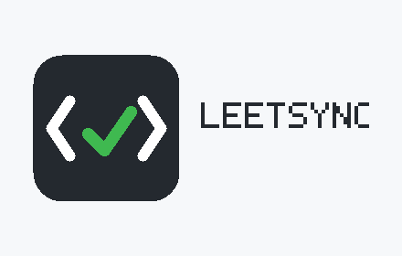

# LeetSync

LeetSync is a small browser extension that saves accepted LeetCode submissions to GitHub. It is built for people who want a useful record of their practice without turning the extension into another account or service.



Version 1.0 supports Microsoft Edge and other Chromium browsers using Manifest V3.

## What it does

After you submit a solution on LeetCode, LeetSync waits for the result. If the submission is accepted, it creates one Git commit containing your solution and, optionally, a short README with the problem metadata.

```text
leetcode/
  0001-two-sum/
    two-sum.py
    README.md
```

Wrong answers and old results are ignored. Submissions that have already been synced are also ignored.

## Install from GitHub Releases

1. Open this repository's **Releases** page.
2. Download the latest `leetsync-VERSION.zip` file.
3. Extract it to a permanent folder.
4. Open `edge://extensions` in Microsoft Edge or `chrome://extensions` in Chrome.
5. Turn on **Developer mode**.
6. Choose **Load unpacked** and select the extracted folder containing `manifest.json`.
7. Pin LeetSync from the browser's Extensions menu.

The ZIP cannot be selected directly; Chromium browsers require the folder to be extracted first. GitHub installations also require manual updates. See [INSTALL.md](INSTALL.md) for complete install and update instructions.

## Install from source

1. Download or clone this repository.
2. Open `edge://extensions` in Microsoft Edge or `chrome://extensions` in Chrome.
3. Turn on **Developer mode**.
4. Choose **Load unpacked** and select the repository root, the folder containing `manifest.json`.
5. Pin LeetSync so its status is easy to reach.

Reload the extension from the extensions page whenever you change its source code.

## Connect GitHub

Create an empty GitHub repository and a fine-grained personal access token:

1. In GitHub, open **Settings > Developer settings > Personal access tokens > Fine-grained tokens**.
2. Limit repository access to the repository you created.
3. Grant **Contents: Read and write** permission.
4. Open the LeetSync popup and enter the token, owner, repository, branch, and destination folder.
5. Select **Check connection** before submitting a solution.

The branch must already exist. An initialized repository with a `main` branch is the simplest setup.

## How syncing works

1. The content script notices a Submit click or the submit keyboard shortcut on a LeetCode problem page.
2. It polls LeetCode for a recent accepted submission from that problem.
3. It fetches the accepted source code and basic problem metadata through LeetCode's GraphQL endpoint.
4. It sends a structured message to the extension service worker.
5. The service worker validates the message and creates Git blobs, a tree, and a commit through GitHub's API.
6. It advances the configured branch only after every file is ready, so the solution and README appear together.
7. The popup keeps the latest success or error for troubleshooting.

The GitHub token never enters the LeetCode page. It is read only by the service worker and sent only to `api.github.com`. See [PRIVACY.md](PRIVACY.md) for the complete data handling statement.

## Project layout

```text
assets/                 Extension icons
store-assets/           GitHub and browser-store artwork
.github/workflows/      Tagged-release automation
docs/ARCHITECTURE.md    Maintainer-level design notes
docs/RELEASE.md         Store packaging checklist
scripts/                Reproducible icon and release tools
src/core.js             Validation and file-generation rules
src/background.js       Storage, diagnostics, and GitHub commits
src/contentScript.js    LeetCode submit detection and data fetching
src/popup.js            Popup interactions
src/popup.css           Popup presentation
tests/                  Browser-independent unit tests
learning/               Earlier educational phases, not shipped
```

The comments in source files explain boundaries, browser behavior, and API decisions. Straightforward assignments and DOM operations are intentionally left uncommented.

## Development

Node.js 20 or newer is used only for local checks and packaging. The extension itself has no runtime dependencies and no build step.

```bash
npm test
npm run check
npm run build
```

`npm run build` creates `dist/leetsync-1.0.0.zip`. The release archive excludes the learning phases, tests, and development scripts.

Pushing a version tag such as `v1.0.0` runs the GitHub Actions release workflow. It tests the extension, builds the same ZIP, and attaches it to a new GitHub Release.

Read [CONTRIBUTING.md](CONTRIBUTING.md) before changing the message contract or sync flow.

## Troubleshooting

- **Nothing happens after Submit:** reload LeetSync from the extensions page, then reload the LeetCode tab. Content scripts already open in a tab are not replaced automatically.
- **GitHub token rejected:** create a new fine-grained token and make sure it can access the selected repository.
- **Repository or branch not found:** check spelling and make sure the branch already exists.
- **LeetCode data error:** stay signed in to LeetCode and retry. LeetCode's GraphQL interface is not a public stable API and may change.
- **A failed result is shown in the popup:** fix the reported setting or permission, then submit again. Failed submissions are not marked as synced.

## Origins and differences

LeetSync is an independent implementation inspired by [LeetHub](https://github.com/QasimWani/LeetHub) and [LeetHub 2.0](https://github.com/arunbhardwaj/LeetHub-2.0). It does not reuse their source code.

The main differences are:

- Manifest V3 service worker instead of a Manifest V2 background page.
- A user-created fine-grained token instead of a client secret embedded in the extension.
- Narrow host access limited to LeetCode and the GitHub API.
- Submission-triggered polling instead of continuously trusting page text.
- One atomic Git commit for all generated files.
- Server-side duplicate protection using recent submission IDs.
- No copied problem statement; generated notes contain metadata and a source link.
- No analytics, remote code, account system, or application server.

## Limitations

- Only `leetcode.com` is supported in version 1.0.
- LeetCode does not expose a stable public submission API, so a site change can require an extension update.
- Sync depends on the LeetCode tab remaining open until the result is available.
- GitHub organization repositories may require organization approval for the token.

## License

LeetSync is available under the [MIT License](LICENSE).
